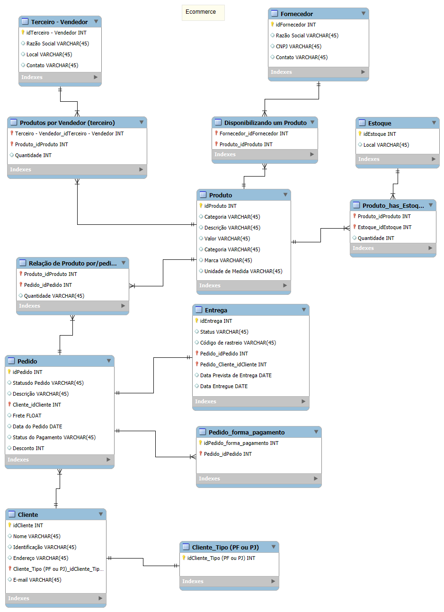

# 🛒 E-commerce - Modelo ER

Este repositório contém a modelagem de banco de dados para um sistema de e-commerce. Foi desenvolvido utilizando o MySQL Workbench como parte do aprendizado de modelagem de banco de dados.

---

## 📊 Diagrama ER

O diagrama acima representa as entidades e relacionamentos necessários para o funcionamento de um sistema de e-commerce.

---

## 📝 Escopo do Projeto

### Produtos
- São vendidos exclusivamente na plataforma online.
- Cada produto está vinculado a um único fornecedor.
- Os produtos podem ser oferecidos por diferentes vendedores.

### Clientes
- Devem ser cadastrados com **CPF** ou **CNPJ**, mas não ambos.
- Podem realizar múltiplos pedidos.

### Pedidos
- Podem conter um ou mais produtos.
- Incluem informações como:
  - Data da compra.
  - Status do pedido.
  - Endereço de entrega.
  - Rastreamento e código de entrega.
- Podem ser cancelados.
- Há um período de carência para devolução.

### Pagamento
- Mais de uma forma de pagamento pode ser associada a um pedido.

### Entregas
- O frete é calculado de acordo com o endereço do cliente.
- Cada entrega possui status e código de rastreio.

---

## 🛠️ Tecnologias Utilizadas
- **MySQL Workbench**: Para criar o modelo conceitual e físico.
- **MySQL**: Para simular a implementação do banco de dados.

---

## 📂 Arquivos no Repositório

- `ecommerce.mwb`: Arquivo original do MySQL Workbench com o modelo completo.
- `diagrama.png`: Imagem exportada do diagrama ER.

---

## 🖥️ Como Visualizar o Projeto

1. Faça o download do arquivo `ecommerce.mwb`.
2. Abra o arquivo no **MySQL Workbench**.
3. Confira o diagrama ER completo e as propriedades das entidades e relacionamentos.

---

## 📚 Aprendizados

Durante a criação deste projeto, foram explorados conceitos como:
- Normalização de banco de dados.
- Criação de chaves primárias e estrangeiras.
- Relacionamentos 1:N e N:M.
- Restrições de integridade e cardinalidade.

---

## 🤝 Contribuições

Contribuições são bem-vindas! Se você encontrar algo a melhorar, sinta-se à vontade para abrir uma *issue* ou enviar um *pull request*.

---

## ⚖️ Licença

Este projeto está licenciado sob a MIT License.
